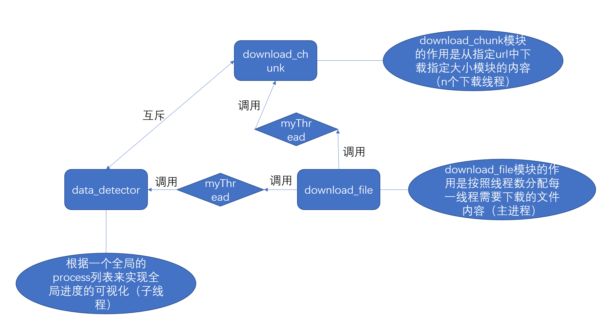
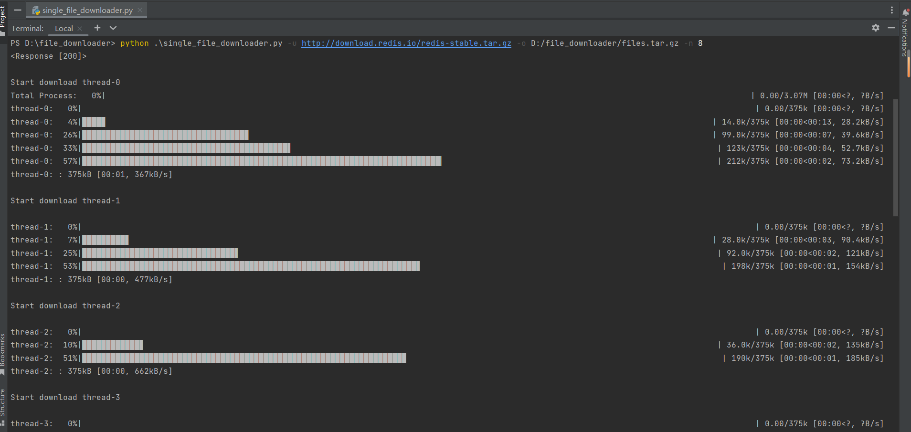
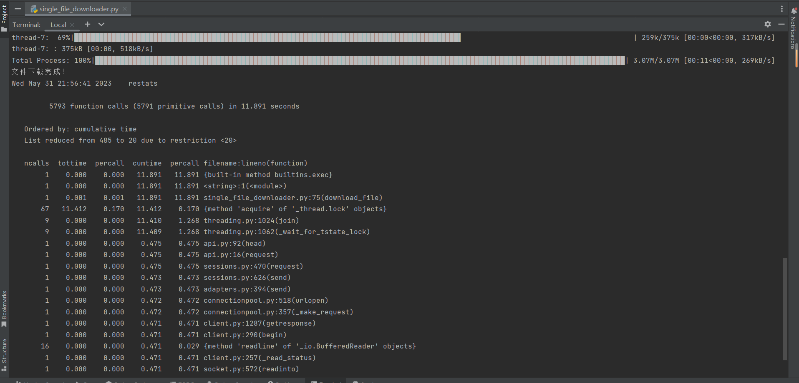

# 第一阶段

## 目标
实现单个文件的并发下载功能

## PSP表
| PSP                                     | Personal Software Process Stages        | 预估耗时（分钟） | 实际耗时（分钟） |
| --------------------------------------- | --------------------------------------- | ---------------- | ---------------- |
| Planning                                | 计划                                    |      60     |      20          |
| · Estimate                              | · 估计这个任务需要多少时间              |      60   |    20    |
| Development                             | 开发                                    |    520   |   980   |
| · Analysis                              | · 需求分析 (包括学习新技术)             |       80    |   360 |
| · Design Spec                           | · 生成设计文档                          |      60|   90  |
| · Design Review                         | · 设计复审 (和同事审核设计文档)         |     20 |   30 |
| · Coding Standard                       | · 代码规范 (为目前的开发制定合适的规范) |      30  |  30  |
| · Design                                | · 具体设计                              |      60  |    30  |
| · Coding                                | · 具体编码                              |       120|    360   |
| · Code Review                           | · 代码复审                              |        30 |   20  |
| · Test                                  | · 测试（自我测试，修改代码，提交修改）  |       120 |  60   |
| Reporting                               | 报告                                    |      110|    80  |
| · Test Report                           | · 测试报告                              |      60   |  30  |
| · Size Measurement                      | · 计算工作量                            |      20  |   30   |
| · Postmortem & Process Improvement Plan | · 事后总结, 并提出过程改进计划          |     30 |   20  |
|                                         | 合计                                    |     690   |       1080  |

## 解题思路
1. 首先知道如何使用url下载文件
2. 其次需要考虑如何使用并发线程下载同一个文件。
3. 在并发线程中需要考虑怎么讲各线程的结果合并，以及需要实现下载进度和整体进度的显示功能。
4. 在学习过程中参考了很多博客的内容以及翻阅了python函数库的技术文档。

## 程序架构

使用**V模型**来进行软件的测试。不同功能分阶段实现，在每一阶段都会测试上一阶段的程序是否完整实现了对应的功能，使用一个url来进行单元测试，**程序分为三个单元**：**多线程下载单元**、**显示进度条单元**、**获取输入参数单元**。在测试过程中首先对代码进行了**静态检查**，然后对一个url输入得出每个模块的输出，其中显示进度条单元是建立在多线程下载单元之上的，所以需要先确认下载的内容不出错，其次显示进度条。

## 实现过程
1. 首先要知道url下是有更多的文件的，而不仅仅是一个文件，我开始理解题目的时候出现了偏差。
2. 然后要学习如何使用python进行多线程编程
3. 因为所给出的网页链接不止有一个文件，所以我需要获取给出的链接中的所有文件数据，然后将其分配给多个线程，然后开始下载所有的数据。
   
>更改后
4. 将已知的文件均分，将不同的chunk分给不同的线程，分别执行下载任务。
5. 直接使用一个文件进行下载，即需要在开始的时候创建一个与目标文件size相同的文件，每个线程下载的时候从目标位置写入即可。
6. 加入进度条，首先加入单个进程的进度条，然后通过线程间的信息共享加入总的进度条。使用range来请求http的内容，可以分段请求数据。

## 遇到的问题
1. 按照上述过程做的时候突然意识到这样就不是下载一个文件了，于是在做完爬取url链接的工作后改为做一个文件的下载工作。
2. 现在需要考虑如何将一个文件的不同部分分给不同的线程，以及不同线程之间的交互的问题。
3. 如何解决线程间信息的通讯问题？互斥锁访问下载列表，连续性下载转变为离散下载（使用batch来决定每次的下载动作）
4. 进度条冗余问题仍待解决。
5. 性能检测并未实现

## 问题解决
1. 对线程上了互斥锁，然后分配每个线程访问网站下载的内容，最终进行并发下载。
2. 使用requests访问网页内容，查看status，决定该网页是否支持并发访问。
3. 检测性能使用cProfile库，这里将耗时最久的函数按照从大到小的顺序排列给出。

## 关键函数代码

**def download_chunk(url, start, end, filename, number):**

    print(f'\nStart download thread-{number}')
    headers = {'Range': f'bytes={start}-{end}'}

    batch_size = 1024 # 每次下载的大小
    content_size=end-start

    response = requests.get(url, headers=headers, stream=True)
    with open(filename, 'wb') as file:
        file.seek(start)
        with tqdm(total=content_size, unit='B', desc=f'thread-{number}: ', unit_scale=True, unit_divisor=1024) as proocess_bar:
            for data in response.iter_content(chunk_size=batch_size):
                file.write(data)
                # 上一个修改process列表的锁
                # threadLock.acquire()
                thread_data[number] += len(data)
                # threadLock.release()
                # 更新线程执行进度
                proocess_bar.update(len(data))

**def download_file(url, filename, concurrency=8):**

    response = requests.head(url)
    file_size = int(response.headers.get('Content-Length', 0))
    chunk_size = file_size // concurrency
    if os.path.exists(filename):
        os.remove(filename)

    # 先写一个文件出来，然后寻找位置
    with open(filename, 'wb') as file:
        file.write(b'\0' * file_size)

    # 通过访问列表来更改已经下载的数据并且来显示总体的进度
    def data_detector():
        last=0
        with tqdm(total=file_size, unit = 'B',unit_scale=True, desc='Total Process: ') as process_bar:
            for i in range(file_size):
                threadLock.acquire()
                total = sum(thread_data)
                threadLock.release()
                delta = total-last
                last=total
                process_bar.update(delta)

    threads = []
    for i in range(concurrency):
        start = i * chunk_size
        end = start + chunk_size - 1 if i < concurrency - 1 else file_size - 1
        thread=myThread(i, url, start, end, filename)
        # thread = threading.Thread(target=download_chunk, args=(i, url, start, end, filename))
        threads.append(thread)
        thread.start()
    # 总进度子线程
    thread_detector = threading.Thread(target=data_detector)
    thread_detector.start()
    threads.append(thread_detector)

    for thread in threads:
        thread.join() # 子线程全部完成后才可以继续执行父线程

    print('文件下载完成！')

## 仍需完善的问题
1. 测试部分仅根据requests库提供的状态码进行编写，并没有实际测试是否可以检测网页是否可并发下载。