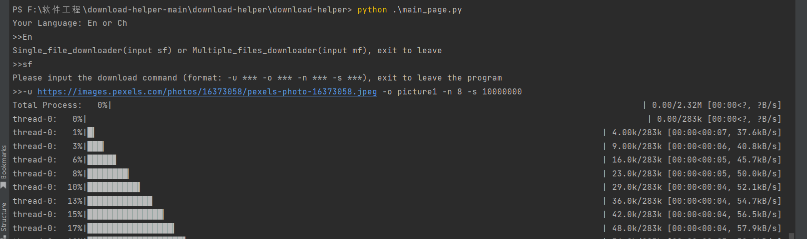

# 第三阶段

## 目标
在上次的基础上新增一些控制文件下载的功能

## PSP表
| PSP                                     | Personal Software Process Stages        | 预估耗时（分钟） | 实际耗时（分钟） |
| --------------------------------------- | --------------------------------------- | ---------------- | ---------------- |
| Planning                                | 计划                                    | 20    |    30|
| · Estimate                              | · 估计这个任务需要多少时间              |      20   |   30   |
| Development                             | 开发                                    |    880   |  1210  |
| · Analysis                              | · 需求分析 (包括学习新技术)             |       180    | 240|
| · Design Spec                           | · 生成设计文档                          |      80  |  80|
| · Design Review                         | · 设计复审 (和同事审核设计文档)         |     30 |  20 |
| · Coding Standard                       | · 代码规范 (为目前的开发制定合适的规范) |      40  |  60|
| · Design                                | · 具体设计                              |      90  |  60 |
| · Coding                                | · 具体编码                              |       180|  240 |
| · Code Review                           | · 代码复审                              |        40 |  60 |
| · Test                                  | · 测试（自我测试，修改代码，提交修改）  |       240 |  450|
| Reporting                               | 报告                                    |    110| 110  |
| · Test Report                           | · 测试报告                              |      60   |  60|
| · Size Measurement                      | · 计算工作量                            |      20  |   20 |
| · Postmortem & Process Improvement Plan | · 事后总结, 并提出过程改进计划          |     30 |   30|
|                                         | 合计                                    |     1010   |  1350|

## 解题思路
1. 首先学习有哪些可以对下载进行限速的方法，发现使用sleep延迟时间即可。
2. 针对下载任务的自动归类问题，首先学习了python如何识别文件的类型，然后打算使用简单的分支语句识别即可。
3. 对于自动解压和安装，仍然查阅了资料，发现在调库后可以实现该功能。
4. 多语言支持则打算新建一个交互界面以及使用分支语句来完成。

## 实现过程
1. 限速即速度不超过最大速度max_speed，若以max_speed的速度下载，则至少需要时间为file_size/max_speed，这样子即使下载速度为∞也不会超过限速。这里限速大小需要作为输入数据传入程序中。
2. 对于文件自动归档，首先学习如何判断文件的类型，发现不能简单的通过文件后缀来判断文件的类型，容易出错，打开文件后有专门描述文件类型的内容，因此可以通过此方法将下载的文件啊归档到不同的目录下，当然在归档过程中需要判断是否第一次创建该目录。
3. 针对解压文件以及运行程序，学习后知道需要使用不同的库函数对不同的类型进行解压以及归档。
4. 对于顶层模块，这里使用了main_page.py来完成所有的控制以及交互功能，

## 遇到的问题
1. 多语言的实现需要将模块进行重新组合，因为需要将所有需要显示的部分合为一体，并且还需要考虑如何进行交互（即在哪里选择语言，这里将语言确定放在了最开始）。
2. 开始的时候不太清楚怎么在程序中调用命令行。
3. 在测试的过程中，因为找不到测试的url，在google中搜索了好久...然后尝试下载后发现图片总是下载不了，还有就是有的压缩文件是.tar.gz，被压缩了两次。(被判定为其他文件了，假设可以识别.gz格式，也并不可以解压缩到最后的文件，代码中并没有实现循环解压缩的功能)
4. 在测试解压缩以及运行文件和自动分类功能的时候遇到了bug，发现程序之只能对最后一个下载的文件进行分类/解压缩/运行。

## 问题解决
1. 在这次的迭代中进行了网站不支持多线程并发下载的检测功能，即使用状态码来判断。
2. 这次迭代中对程序的结束做了处理，在任务队列中的任务都结束后结束进程。
3. 这次迭代中对输入参数格式进行了出错处理。
4. 在实现多语言的时候，这里新建了一个python文件：main_page.py，将其用来实现所有的控制以及功能调用的内容。
5. 查询资料后发现可以使用subprocess.Popen()创建子进程，从而完成单文件下载的任务。
6. 在本阶段，在测试单元的功能的时候找到了不支持并发下载的内容，即补充了之前的测试内容。
7. 在测试过程中，在一些免费的图片网上可以找到有url的图片(如:https://www.pexels.com/zh-cn/)，对于压缩文件并没有找到一个合适的下载网站，有些网站的压缩文件并不符合测试要求，不支持多线程下载。最终找到一个sample_file完成了测试。
8. 针对问题4的bug，我调试了对文件的操作在程序中的位置后终于解决了这个问题，并且对整体进度条做了修改。因为之前对thread.join()的理解不够，导致whole_process_bar并不是真正意义上的whole_process_bar，而是所有线程运行完后才有的一个下载进度之和，修改后的代码让其是真正的whole_process_bar，可以实时统计下载进度。

## 关键函数代码
**main_page**：程序的交互界面

    def main():
        basic_language = input("Your Language: En or Ch\n>>")

        while True:
            if basic_language == 'En':
                basic_function = input("Single_file_downloader(input sf) or Multiple_files_downloader(input mf), exit to leave\n>>")
                # 单个文件的下载
                if basic_function == 'sf':
                    input_command = input("Please input the download command (format: -u *** -o *** -n *** -s ***), exit to leave the program\n>>")
                    if input_command == 'exit':
                        sys.exit(1)
                    else:
                        args = decoder.args_decoder(input_command)
                        p = subprocess.Popen(
                            ["python", ".\\file_downloader.py", "-u", args.url, "-o", args.output, "-n",
                            str(args.concurrency), "-s", str(args.speed)]
                            , stdin=subprocess.PIPE, stdout=subprocess.PIPE)
                        p.wait()
                        # 自动归类以及自动解压等等功能

                elif basic_function == 'mf':
                    input_file = input("Please pack the urls as a file and input the urls_file_path, exit to leave the program\n>>")
                    if input_file == 'exit':
                        sys.exit(1)
                    else:
                        multiple_file_downloader.downloader(input_file)

                elif basic_function == 'exit':
                    sys.exit(1)
            elif basic_language == 'Ch':
                basic_function = input("单个文件下载功能(输入”sf“开始下载)，多个文件下载功能(输入“mf”开始下载)，“exit”结束程序“\n>>")
                # 单个文件的下载
                if basic_function == 'sf':
                    input_command = input("请输入下载命令（格式：-u *** -o *** -n *** -s ***）,输入“exit”离开程序\n>>")
                    if input_command == 'exit':
                        sys.exit(1)
                    else:
                        args = decoder.args_decoder(input_command)
                        p = subprocess.Popen(
                            ["python", ".\\file_downloader.py", "-u", args.url, "-o", args.output, "-n",
                            str(args.concurrency), "-s", str(args.speed)]
                            , stdin=subprocess.PIPE, stdout=subprocess.PIPE)
                        p.wait()

                elif basic_function == 'mf':
                    input_file = input("请将多条下载命令写入文件中并将文件路径输入，输入“exit”离开程序\n>>")
                    if input_file == 'exit':
                        sys.exit(1)
                    else:
                        multiple_file_downloader.downloader(input_file)
                elif basic_function == 'exit':
                    sys.exit(1)

**multiple_file_downloader**：多文件下载函数(本次迭代中将多文件下载部分和file_downloader模块剥离，单独形成一个文件，被main_page调用)

    input_stream = []
    def downloader(urls_file):
        decoder.decoder(input_stream, urls_file)
        download_manager = file_downloader.DownloadManager('ALL_TASKS_GOING_NOW')
        for item in input_stream:
            download_manager.add_download(item[0], item[1], item[2], item[3])

        download_manager.start()

## 单元测试
### 速度限制测试：
这里使用100B/s与1000B/s进行测试：

### 下载任务分类和归档功能测试：
这里使用多任务下载来测试，因为不需要解压/运行的文件在本质上是一类，因此这里只使用了picture来代表不需要解压/运行的文件，其余需要解压和运行的使用了**条件覆盖**来进行测试：

所有的测试下载任务都装在了download_me.txt文件中：

这里是在所有的功能完成后才进行的测试，所以使用main_page来完成所有的交互功能，下面是开始的界面：

在过程中的界面如下：

这里加入了一些调试语句，在一定的时候会启动总的进度条以及输出当前正在下载的文件类型以及名称。

这里是两个exe文件下载完成后的运行界面：

这里是压缩文件的解压缩：
（其中.7z文件由于内容问题导致不能解压缩过程出现异常，这里给出部分解压缩后的结果）

这里是图片下载的测试结果：

下面是自动分类的结果：

### 界面测试：

### 不支持多线程网站测试：
这里补充测试了不支持多线程的网站的异常抛出：

在返回的status_code不符合要求后会输出错误信息以及当前网页的状态码。

## 性能测试：
这里对单文件下载进行了性能分析，可以看到主要的时间消耗来源于I/O以及等待信号的过程，其次是参数解析过程，可见程序中其他部分相对于I/O的时间消耗是微不足道的，程序的未来改进方向是如何更快的输入输出以及在线程间的通讯中的信号机制。

## 仍需完善的问题
1. 在测试的过程中，解压7z文件出现了报错，针对错误并没有进行完美的解决。(解压的文件因为含有python不支持的字符因而不能使用库函数继续解压。)
2. 没有将任务的暂停、恢复、取消功能加入main_page的设计中，这个有待完善。
