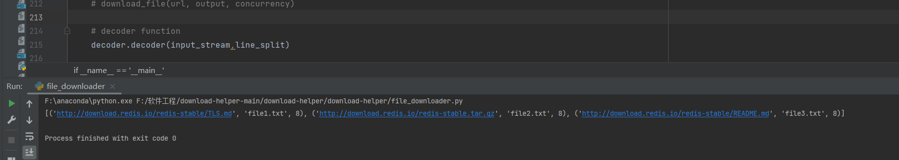

# 第二阶段

## 目标
新增一些文件下载的功能

## PSP表
| PSP                                     | Personal Software Process Stages        | 预估耗时（分钟） | 实际耗时（分钟） |
| --------------------------------------- | --------------------------------------- | ---------------- | ---------------- |
| Planning                                | 计划                                    |      60     |      20          |
| · Estimate                              | · 估计这个任务需要多少时间              |      60   |    20    |
| Development                             | 开发                                    |    760   |   1300   |
| · Analysis                              | · 需求分析 (包括学习新技术)             |       300    |   420 |
| · Design Spec                           | · 生成设计文档                          |      80  |   60  |
| · Design Review                         | · 设计复审 (和同事审核设计文档)         |     20 |   20 |
| · Coding Standard                       | · 代码规范 (为目前的开发制定合适的规范) |      30  |  80  |
| · Design                                | · 具体设计                              |      60  |    60  |
| · Coding                                | · 具体编码                              |       120|    420   |
| · Code Review                           | · 代码复审                              |        30 |   60  |
| · Test                                  | · 测试（自我测试，修改代码，提交修改）  |       120 |  180   |
| Reporting                               | 报告                                    |      110|    160  |
| · Test Report                           | · 测试报告                              |      60   |  120  |
| · Size Measurement                      | · 计算工作量                            |      20  |   20   |
| · Postmortem & Process Improvement Plan | · 事后总结, 并提出过程改进计划          |     30 |   20  |
|                                         | 合计                                    |     930   |       1480  |

## 解题思路
1. 首先理解使用队列下载文件的含义以及方法。
2. 学习之后发现需要使用python库中queue的内容来实现
3. 针对下载队列和实现添加多个下载内容，我理解的是需要创建一个队列来存储多个即将下载的任务，然后将他们每个任务调用一个子线程来进行下载，在每个子线程中还会调用多个子线程来实现多线程下载文件。
4. 在实现批量加入下载地址的时候不太清楚如何将多个带参数说明的下载要求作为命令行的输入，于是打算放弃参数说明，按照一个规则来输入对应的命令。即：按照url savepath concurrency来实现命令的解析
5. 在尝试之后发现不太可以实现，于是决定使用输入参数文件来完成命令行的解析工作。
6. 通过学习后发现可以使用threading中的event类来完成对线程的暂停，恢复，取消等操作。本身想使用sigint控制子线程的暂停，重启，取消，但并没有实现，于是改回event类。
7. 针对批量下载的功能，考虑使用队列来进行一个生产者消费者的活动过程，即我们的输入作为生产者，然后线程执行作为消费者。
8. 对于断点续传的内容，首先学习了什么是断点续传，然后再进行具体的设计与编码。

## 实现过程
1. 首先文件的下载过程变为了：存在一个任务队列，可以有很多的任务被添加进去，即为url_queue，添加任务的函数为add_download()，我们完成下载的过程即为一个消费的过程(生产的过程为添加下载任务)，其中我们需要不断的查看队列中是否有待下载的任务，如果有的话需要立即下载，否则继续查询即可。每一次的下载过程都使用多线程的下载过程。
2. 针对多任务的输入，这里使用文件作为读入窗口，然后使用decoder模块对其进行解析，在主程序中将多个任务添加到下载队列中。
3. 针对断点续传的功能，如果是单线程，那么只需要判断当前下载了的内容然后进行续传即可，但是当前是多线程且多个任务的下载过程，所以我们需要首先判断在哪个任务出现了断点，然后找到对应的暂停的chunk，然后对该块以及后面未传的块重传。

## 遇到的问题
1. 怎么将多个任务输入呢？这里选择简单处理，只允许使用add_download来作为任务输入函数，每一次添加任务需要按照对应的格式输入。
2. 在编程的过程中发现总的进度条总是出现数据耦合，从而导致错误，于是打算重组单个文件的下载模块，将其作为一部分融合进入队列下载的类中。
3. 在写的过程中以为文件下载到本地就可以了，在打开后发现只有最后一个线程的下载内容，思考后发现是在多线程操作时打开目标文件的方式不对，使用了wb+方式，因此每次写操作都会进行覆盖，这样才导致了错误。

## 问题解决
1. 针对多任务输入问题，可以先将所有的任务序列写入文档中，然后在程序开始的时候需要增加一个预处理的过程，对每一行的内容进行解析之后再加入队列来处理。
2. 针对数据耦合，将总的进度条写入每个文件的下载类中，这样子不会出现在启动多个线程后多个文件下载进度共用一个thread_data（文件的下载进度）的读脏数据的问题。
3. 针对上周的进度条冗余问题给出了较好的解决，对多线程部分的代码进行修改和更规范的书写后进度条冗余问题消失，还有并不
4. 将打开文件的方式改为二进制追加写即可。

## 关键函数代码

负责顶层的下载任务管理，任务队列的实现，以及下载的暂停、恢复、取消等操作

**class DownloadManager(threading.Thread):**

    def __init__(self, thread_name):
        super(DownloadManager, self).__init__(name=thread_name)
        self.url_queue = Queue()    # urls_queue where we can put and get info from
        self.__flag = threading.Event()
        self.__flag.set()   # means __flag is true  flag--pause
        self.__running = threading.Event()
        self.__running.set()    # running -- cancel

    # how this thread runs by cpu ----consumer
    def run(self):
        print("Start downloading...")
        while self.__running.isSet():
            self.__flag.wait()  # if true then run the process, else just wait until __flag turns true.
            ### run program
            while not self.url_queue.empty():
                url, save_path, con = self.url_queue.get()
                downloader=single_downloader(url,save_path,con)
                # downloader.download_file(url, save_path, con)
                downloader.setDaemon(True)
                downloader.start()
                downloader.join()
                self.url_queue.task_done()

    # add file download tasks  ----producer
    def add_download(self, url, save_path,con_number):
        self.url_queue.put((url, save_path, con_number))

    def pause(self):
        self.__flag.clear()

    def resume(self):
        self.__flag.set()

    def cancel(self):
        self.__flag.set()
        self.__running.clear()
        os.kill(os.getpid(), signal.SIGTERM)

单个文件下载模块，在多任务下载的过程中，每次下载都需要掉用这个模块来进行多线程下载，这个类将week1的所有功能加以整合并加入了断点重传的功能。

**class single_downloader(threading.Thread):**

    def __init__(self,url, filename, con):
        threading.Thread.__init__(self)
        self.thread_data=[0]*con
        self.url = url
        self.filename = filename
        self.con = con
        self.resume = False

    def run(self):
        # need to get a key then run the sub-process
        threadLock.acquire()
        # download a part of this file, so... we need to know which part to download.
        self.download_file(self.url, self.filename, self.con)
        threadLock.release()

    # used to assign jobs to different threads ---- downloader top layer
    def download_file(self, url, filename, concurrency=8):
        # 粗粒度断点重传 如果从当前chunk断掉则连同当前块一起重传
        response = requests.head(url)
        file_size = int(response.headers.get('Content-Length', 0))
        chunk_size = file_size // concurrency
        if os.path.exists(filename):
            self.resume=True
            first_byte=os.path.getsize(filename)
            first_byte=first_byte//chunk_size   # the chunk needed to be retransmitted
        else:
            first_byte=0

        first_byte=first_byte*chunk_size    # the exact position we need to start downloading
        # download the rest of this file
        chunk_size = (file_size - first_byte) // concurrency

        # 通过访问列表来更改已经下载的数据并且来显示总体的进度
        def data_detector():
            last = 0
            with tqdm(total=file_size, unit='B', unit_scale=True, desc='Total Process: ') as process_bar:
                for i in range(file_size):
                    threadLock.acquire()
                    total = sum(self.thread_data)
                    threadLock.release()
                    delta = total - last
                    last = total
                    process_bar.update(delta)

        # used for downloading a part of a file
        def download_chunk(url, start, end, filename, number):
            print(f'\nStart download thread-{number}')
            headers = {'Range': f'bytes={start}-{end}'}

            batch_size = 1024  # 每次下载的大小
            content_size = end - start

            response = requests.get(url, headers=headers, stream=True)
            with open(filename, 'ab+') as file:
                file.seek(start)
                # tagged resume process
                if self.resume:
                    file.write(TAG)
                    self.resume=False

                with tqdm(total=content_size, unit='B', desc=f'thread-{number}: ', unit_scale=True,
                          unit_divisor=1024) as proocess_bar:
                    for data in response.iter_content(chunk_size=batch_size):
                        file.write(data)
                        self.thread_data[number] += len(data)
                        # 更新线程执行进度
                        proocess_bar.update(len(data))

        # sub_process bar
        for i in range(concurrency):
            start = first_byte + i * chunk_size
            end = start + chunk_size - 1 if i < concurrency - 1 else file_size - 1
            thread = Thread(target=download_chunk, args=(url, start, end, filename, i,))
            thread.setDaemon(True)
            thread.start()
            thread.join()  # join() is set

        # all_process bar
        thread_detector = Thread(target=data_detector)
        thread_detector.setDaemon(True)
        thread_detector.start()

        print('文件下载完成！')

FTP下载的类，实现较为简单，不支持并发下载。

**class ftp_downloader:**

    def __init__(self, url):
        self.ftp=ftplib.FTP(url)
    def cwd(self,dir):
        self.ftp.cwd(dir)

    def Login(self, user='', passwd=''):
        self.ftp.login(user, passwd)
        # print(self.ftp.welcome)

    def DownLoadFile(self, LocalFile, RemoteFile):  # 下载单个文件
        file_handler = open(LocalFile, 'wb+')
        bufsize=1024
        # self.ftp.retrbinary("RETR %s" % (RemoteFile), file_handler.write)#接收服务器上文件并写入本地文件
        self.ftp.retrbinary('RETR ' + RemoteFile, file_handler.write,bufsize)
        file_handler.close()
        print("Ftp Download Successfully!")
        return True

    def close(self):
        self.ftp.quit()

输入文件的分析函数，将文件形式的多个下载任务转为一个列表然后在主函数中加入队列中

**def decoder(input_stream,line_split):**

    url="url"
    out_path="out_path"
    con=8
    # format: -u &&& -o &&& -n &&&
    file = open("input_file_name.txt","r")
    for line in file:
        line_split.clear()
        line_split.append(line.split()) # split by space
        flatten_list=[item for sublist in line_split for item in sublist]
        # scan and decode the information
        for __ in range(0, len(flatten_list), 2):
            if (flatten_list[__] == "-u") or (flatten_list[__] =="--url"):
                url = flatten_list[__+1]
            elif (flatten_list[__] == "-o") or (flatten_list[__] =="--output"):
                out_path = flatten_list[__+1]
            elif (flatten_list[__] == "-n") or (flatten_list[__] =="--concurrency"):
                con = int(flatten_list[__+1])
        input_stream.append((url,out_path,con))

## 单元测试
这里对所有的函数或模块进行了黑盒测试。

### 测试decoder：
将文件输入，理论输出为按照格式解析好的多维列表：

### 测试add_download:
这里将decoder的输出结果加入url_queue后进行输出，看在队列中是否存在相应的下载任务：

### 测试pause&resume:
这里使用系统自带时间作为标准，然后在测试的过程中看是否完成了停止与下载任务的重新启动，因为在start之后就不会测试DownloadManager类的run函数中的第一个循环，因此改变__flag并不会对线程的暂停造成任何影响，因此需要在开始前设置为False，然后在结束下载后可以任意改变程序的pause/resume，这个在测试中也有对应的结果。

    这里使用了查询__flag的方式判断线程是否被阻塞，以下三种情况分别是无pause，只有pause以及pause&resume

### 测试cancel:
这里在程序运行一定时间后进行了cancel：

### 测试断点续传功能：
为了标记是否进行了断点续传，这里在程序中做了TAG的符号标记：

    TAG = "****RESUME FROM HERE****"
    TAG = TAG.encode()
在重传的位置会有这一段代码的出现。

在测试的时候每次传输2s然后中断任务，可以看到在中断两次后最终文件的结果如下：

可以看到在每个断点都可以进行续传。

### 测试ftp传输：
从一个开源ftp服务器上获取一个文件，测试结果如下：

## 性能测试：
这里仍然使用cProfile对程序的性能进行测试，使用main()函数对主函数的运行加以包装，若需要测试其他功能的性能，则在main()函数中进行更改即可，这里列出在ftp下载过程中消耗排名前10的函数。

## 仍需完善的问题
1. 在所有任务结束后程序并不会自动结束，因为我没有做一个检测是否下载完成的函数。需要手动结束所有的进程。
2. 不能够在线程启动后暂停该线程，因为代码设计的缘故，通过__flag来完成对线程启动的设置，导致在测试的时候需要在启动前就先暂停，然后测试该模块是否正常工作。
3. ftp传输完成的较为简单，并未做多线程。
