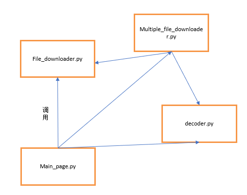

设计文档

# 概要设计
程序共四个文件，main_page.py为程序的主入口，提供命令行的交互功能，调用File_downloader.py、Multiple_file_downloader.py、decoder.py来完成单个文件下载功能，多个文件下载功能。

Main_page包含组件为：
DownloadManager类、single_downloader类、multiple_file_downloader类

Main_page.py的序列图为：

# 详细设计

程序中的类包括：

## DownloadManager

**属性**

***url_queue***
：url队列，用于存储多任务

***__flag*** 
：若__flag.set()，则认为继续执行当前下载任务，否则停止下载。

***__running***
：若__running.set()，则认为继续执行当前程序，否则取消下载。

**方法**

***run(self)***
：子线程的执行方法（这里是指每个下载任务）

***add_download(self, url, save_path,con_number,max_speed)***
：添加新的下载任务

***pause(self)***
：暂停下载

***resume(self)***
：继续下载

***cancel(self)***
：取消下载

## single_downloader

**属性**

***thread_data***
：存储每个线程下载的数据量

***url***
：存储当前下载任务的url

***filename***
：存储下载文件的名称

***con***
：并行度

***resume***
：标志是否进行断点续传

***max_speed***
：最大下载速度（B/s）

**方法**

***run(self)***
：子线程的执行方法（这里是指下载任务的每个子线程）

***download_file(self, url, filename, max_speed, concurrency=8)***
：单文件下载方法，包含粗粒度断点续传（如果从当前chunk断掉则连同当前块一起续传），其中包含了**data_detector()**、**download_chunk(url, start, end, filename, number,max_speed)**子函数，分别完成了监视子线程下载进度，单文件下载子模块的功能

## ftp_downloader

**属性**

***ftp***
：ftp下载任务实体

**方法**

***cwd(self,dir)***
：登录ftp服务器后，改变路径

***Login(self, user='', passwd='')***
：登录ftp服务器函数

***DownLoadFile(self, LocalFile, RemoteFile)***
：下载单个文件

***close(self)***
：关闭ftp连接

## classifier

**属性**

***type_dict***

        type_dict = {
                'FFD8FF': 'jpg', '89504E47': 'png', '47494638': 'gif', '49492A00': 'tif',
                '424D': 'bmp', '38425053': 'psd', '7B5C727466': 'rtf', '3C3F786D6C': 'xml',
                '68746D6C3E': 'html', '44656C69766572792D646174653A': 'eml', 'CFAD12FEC5FD746F': 'dbx', '2142444E': 'pst',
                'D0CF11E0': 'doc/xls', '5374616E64617264204A': 'mdb', 'FF575043': 'wpd', '252150532D41646F6265': 'ps/eps',
                '255044462D312E': 'pdf', 'AC9EBD8F': 'qdf', 'E3828596': 'pwl', '504B0304': 'zip',
                '52617221': 'rar', '57415645': 'wav', '41564920': 'avi', '2E7261FD': 'ram',
                '2E524D46': 'rm', '000001BA': 'mpg', '000001B3': 'mpg', '6D6F6F76': 'mov', '3026B2758E66CF11': 'asf',
                '4D546864': 'mid', '377ABCAF271C':'7z', '4D5A':'exe',
            }
：是一串常量，用来识别文件

**方法**

***bytes2hex(self,bytes)***
：将对应的二进制数转成16进制字符串

***get_filetype(self,filename)***
：获得文件类型并且实现任务的自动解压和安装功能以及下载任务的自动分类和归档功能

程序中的其他函数包括：

## def main()
功能：交互

返回值：无返回值

作为 ***main_page.py*** 和 ***file_downloader.py*** 的交互函数，在程序运行的时候，使用main()将所有功能包装起来，用来完成程序性能的测试。

## def downloader(urls_file)

功能：多任务下载函数

返回值：无返回值

在**multiple_file_downloader.py**实现的函数，将**file_downloader.py**中的文件下载功能包装在新的函数中，在**main_page.py**中被调用。

## def args_decoder(args)

功能：解析参数

返回值：返回args.url、args.output、args.concurrency、args.speed

## def decoder(input_stream, urls_file)

功能：将多个任务的url文件根据格式译码后，将多个下载任务添加至 ***input_sream*** 序列中，等待加入下载队列。

返回值：无返回值

多任务下载时构成下载文件的格式为：

    format: -u @@@ -o @@@ -n @@@ -s  @@@ 
    @@@代表对应位置的输入内容
